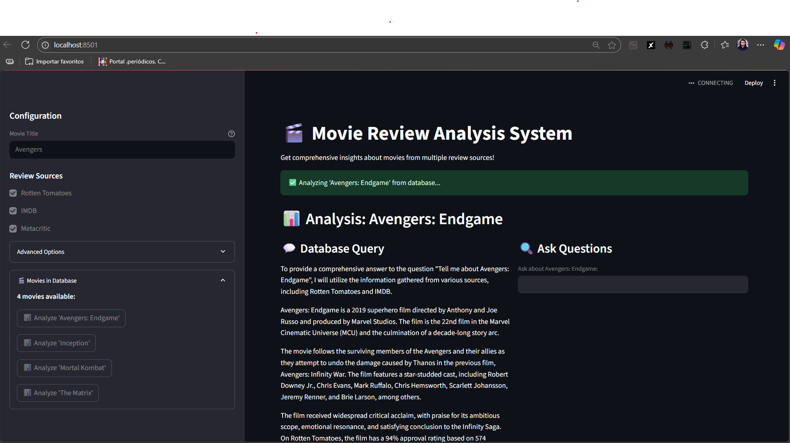

# 🎬 Movie RAG System

*From Hours of Research to Instant Insights*

## The Story Behind This Project

As a passionate movie enthusiast, I used to spend countless hours checking reviews across multiple platforms before watching any film. I would jump between IMDB, Rotten Tomatoes, Metacritic, and various review sites, trying to get a comprehensive understanding of a movie's quality, plot, and critical reception. This time-consuming process often took longer than actually watching the movie itself!

That's when I decided to build this **Movie RAG (Retrieval-Augmented Generation) System** - a solution that aggregates movie information from multiple sources and provides instant, comprehensive insights using AI. Now, instead of wasting hours researching, I can get detailed movie analysis and recommendations in seconds.


*The Movie RAG System in action - analyzing "Avengers: Endgame" with comprehensive insights*

## 🚀 What This System Does

This RAG system revolutionizes how movie enthusiasts research films by:

- **Aggregating Reviews**: Automatically collects data from IMDB, Rotten Tomatoes, and Metacritic
- **AI-Powered Analysis**: Uses advanced language models to provide comprehensive movie insights
- **Instant Search**: Vector-based similarity search for quick movie discovery
- **Interactive Q&A**: Ask any question about movies in your database
- **Smart Recommendations**: Get suggestions based on your preferences

## 🎯 Key Features

### 1. **Multi-Source Data Collection**
- **IMDB Scraper**: Extracts ratings, cast, plot summaries, and user reviews
- **Rotten Tomatoes**: Gathers critic scores, audience ratings, and professional reviews
- **Metacritic**: Collects metascores and detailed critical analysis
- **Smart Aggregation**: Combines data from all sources for comprehensive movie profiles

### 2. **AI-Powered Movie Analysis**
- **Vector Database**: ChromaDB integration for efficient movie data storage and retrieval
- **Semantic Search**: Find movies based on plot, genre, themes, or any criteria
- **LLM Integration**: Groq's compound-beta model for intelligent movie analysis
- **Context-Aware Responses**: Get detailed answers about any movie in your database

### 3. **Interactive Web Interface**
- **Streamlit UI**: Clean, intuitive interface for movie exploration
- **Real-time Analysis**: Instant movie insights and recommendations
- **Database Overview**: Browse all movies in your collection
- **Question System**: Ask specific questions about movies and get AI-powered answers

### 4. **Advanced Search Capabilities**
- **Similarity Matching**: Find movies similar to ones you love
- **Multi-criteria Search**: Search by genre, year, rating, cast, or plot elements
- **Relevance Scoring**: See how closely results match your query
- **Smart Filtering**: Configurable similarity thresholds for precise results

## 🛠️ Technical Architecture

### Core Components

```
movie-rag-system/
├── src/
│   ├── models/
│   │   └── movie_data.py         # Movie data structures
│   ├── scrapers/
│   │   ├── base_scraper.py       # Base scraper with Edge WebDriver
│   │   ├── imdb_scraper.py       # IMDB data extraction
│   │   ├── rotten_tomatoes_scraper.py  # RT reviews and ratings
│   │   ├── metacritic_scraper.py # Metacritic scores and reviews
│   │   └── scraper_manager.py    # Orchestrates all scrapers
│   ├── rag/
│   │   ├── vector_database.py    # ChromaDB integration
│   │   ├── movie_rag_system.py   # Main RAG orchestrator
│   │   └── llm_client.py         # Groq LLM integration
│   ├── crews/
│   │   └── movie_analysis_crew.py # Advanced AI analysis workflows
│   ├── app.py                    # Streamlit web interface
│   └── cli.py                    # Command line interface
├── scripts/
│   ├── add_sample_data.py        # Sample movie data loader
│   └── launch_streamlit.py       # Quick setup and launch
├── tests/                        # Comprehensive test suite
├── main.py                       # Main application entry point
└── cli.py                        # CLI entry point
```

### Technology Stack

- **Vector Database**: ChromaDB for semantic movie search
- **Web Scraping**: Selenium with Microsoft Edge WebDriver
- **AI/LLM**: Groq compound-beta model for natural language processing
- **Web Framework**: Streamlit for interactive user interface
- **Data Processing**: Pandas and NumPy for data manipulation
- **Environment**: Python 3.8+ with virtual environment support

## 📋 Setup Instructions

### Prerequisites

- Python 3.8 or higher
- Microsoft Edge browser (for web scraping)
- Groq API key (free tier available)

### Quick Start

1. **Clone the repository**:
   ```bash
   git clone https://github.com/yourusername/movie-rag-system.git
   cd movie-rag-system
   ```

2. **Set up virtual environment**:
   ```bash
   python -m venv .venv
   .venv\Scripts\activate  # Windows
   # or
   source .venv/bin/activate  # Linux/Mac
   ```

3. **Install dependencies**:
   ```bash
   pip install -r requirements.txt
   ```

4. **Configure environment**:
   Create a `.env` file in the root directory:
   ```env
   GROQ_API_KEY=your_groq_api_key_here
   ```

5. **Launch the application**:
   ```bash
   streamlit run main.py
   ```

   Or use the quick launcher:
   ```bash
   python scripts/launch_streamlit.py
   ```

## 🎮 Usage Examples

### Web Interface

1. **Start the application**: Run `streamlit run main.py`
2. **Browse movies**: View all movies in the "Movies in Database" section
3. **Search movies**: Enter movie titles in the search box
4. **Ask questions**: Use the Q&A feature to get detailed insights
5. **Analyze movies**: Click "Analyze" buttons for comprehensive reviews

### Command Line Interface

```bash
# Launch CLI
python cli.py

# Add sample data
python scripts/add_sample_data.py

# Quick test
python src/quick_test.py
```

### API Usage

```python
from src.rag.movie_rag_system import MovieRAGSystem

# Initialize the system
rag = MovieRAGSystem()

# Search for movies
results = rag.query("action movies with time travel")

# Get specific movie analysis
analysis = rag.analyze_movie("Inception")
```

## 🔧 Configuration

### Environment Variables

- `GROQ_API_KEY`: Your Groq API key for LLM access
- `DEBUG`: Set to `1` for debug logging
- `SIMILARITY_THRESHOLD`: Default similarity threshold (0.1)

### Customization Options

- **Similarity Threshold**: Adjust in `src/rag/movie_rag_system.py`
- **Scraper Settings**: Configure timeouts and delays in scraper classes
- **LLM Model**: Change model selection in `src/rag/llm_client.py`
- **Database Collection**: Modify ChromaDB collection name

## 🧪 Testing

Run the comprehensive test suite:

```bash
# Run all tests
pytest tests/

# Run specific test categories
pytest tests/test_scrapers.py    # Web scraping tests
pytest tests/test_rag_system.py  # RAG system tests
pytest tests/test_models.py      # Data model tests
pytest tests/test_crews.py       # AI crew tests
```

## 🚨 Troubleshooting

### Common Issues

1. **ChromaDB Metadata Errors**
   - Solution: Ensure genre fields are strings, not lists
   - Location: Fixed in `src/rag/vector_database.py`

2. **No Search Results**
   - Solution: Lower similarity threshold (default: 0.1)
   - Location: `src/rag/movie_rag_system.py`

3. **WebDriver Issues**
   - Solution: Ensure Microsoft Edge is installed
   - Note: Driver is auto-downloaded and configured

4. **API Rate Limits**
   - Solution: Add delays between scraping requests
   - Location: Configured in scraper base class

### Debug Mode

Enable detailed logging:
```bash
set DEBUG=1  # Windows
export DEBUG=1  # Linux/Mac
```

## 🤝 Contributing

I welcome contributions to improve this movie research tool! Here's how you can help:

1. **Fork the repository**
2. **Create a feature branch**: `git checkout -b feature/amazing-feature`
3. **Make your changes**: Add new scrapers, improve AI analysis, enhance UI
4. **Add tests**: Ensure your changes are well-tested
5. **Submit a pull request**: Describe your improvements

### Areas for Contribution

- **New Data Sources**: Add scrapers for additional movie sites
- **Enhanced AI**: Improve analysis algorithms and prompts
- **UI Improvements**: Enhance the Streamlit interface
- **Performance**: Optimize vector search and caching
- **Mobile Support**: Make the interface mobile-friendly

## 📄 License

This project is open source and available under the MIT License. Feel free to use, modify, and distribute as needed.

## 🎬 Final Thoughts

This project transformed my movie research experience from hours of manual checking to seconds of AI-powered analysis. Whether you're a casual movie watcher or a cinema enthusiast like me, this system saves time while providing deeper insights than traditional review aggregation.

The best part? It learns and improves with each movie added to the database, making your movie discovery journey more efficient and enjoyable.

**Happy movie watching!** 🍿

---

*Built with passion for movies and powered by cutting-edge AI technology.*
